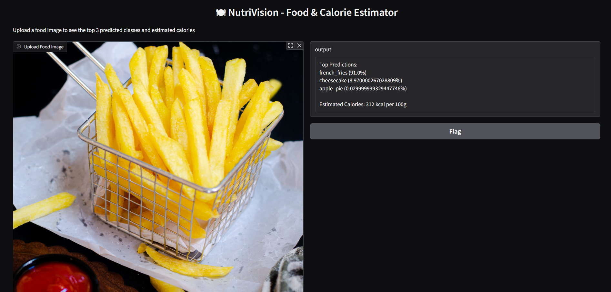

# 🍽 NutriVision - Food Recognition & Calorie Estimator

NutriVision is an AI-powered web app that classifies food items from uploaded images and estimates their calorie content (kcal per 100g). It uses transfer learning with ResNet50, fine-tuned on a subset of the Food-101 dataset. The model is deployed using Gradio for an interactive experience.

---

## 🧠 Features

- 🍔 Predicts food class from an image
- 🔥 Estimates calories using a custom CSV mapping
- 🎯 Displays top 3 predictions with confidence %
- ⚡ Runs live in Google Colab using Gradio
- 📸 Instant image upload and preview

---

## 🧰 Tech Stack

- Python, TensorFlow/Keras
- OpenCV, NumPy, Pandas
- ResNet50 + Transfer Learning
- Gradio (for web interface)
- Google Colab (GPU training)

---

